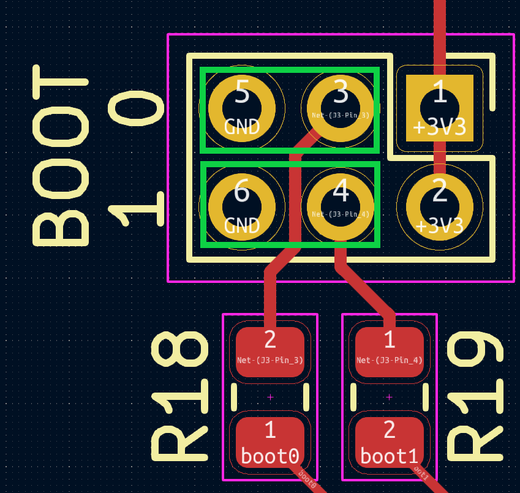

This is a respin of [SukkoPera's](https://github.com/SukkoPera) original [OpenFlops](https://github.com/SukkoPera/OpenFlops) project to create a custom version that plugs directly into the male 50 pin disk header of a Ferguson Big Board SBC Z80 computer.  Changes from the original version include:

- Updated to KiCad 7.x
- Switched from USB to Micro SD for image storage
- Switched to 74LS07's for buffers
- Interface is a now a 50 pin connector and PCB laid out specifically for the Ferguson use case

Schematic - [https://djtersteegc.github.io/OpenFlops-Ferguson/OpenFlops-Ferguson-Schematic-v1.0.pdf](https://djtersteegc.github.io/OpenFlops-Ferguson/OpenFlops-Ferguson-BOM-v1.0.csv)

### BOM

Interactive - [https://djtersteegc.github.io/OpenFlops-Ferguson/ibom-v1.0.html](https://djtersteegc.github.io/OpenFlops-Ferguson/ibom-v1.0.html)

CSV - [https://djtersteegc.github.io/OpenFlops-Ferguson/OpenFlops-Ferguson-BOM-v1.0.csv](https://djtersteegc.github.io/OpenFlops-Ferguson/OpenFlops-Ferguson-BOM-v1.0.csv)

For the MCU I switched from the STM32F105RBT6 to the Artery AT32F435RGT7 which is now well supported by FlashFloppy and a more capable chip for potential future expansion (dual drives?). You could also build with the STM32F105RBT6 and use the appropiate STM programmer and FlashFloppy firmware version.

C12 is a extra bulk capacitor footprint I added near the MCU in case it was needed.  I've run mine without and seems fine, so can be considered optional.  Measured current draw on the board is around 100ma, with the OLED display active.

### Assembly

Do all the SMD components first using your favorite method.  I tried the Proto-Advantage PA0096-S TQFP-64 stencil for the MCU since I didn't have another one anywhere and was to cheap to get a proper stencil from JLCPCB, but unfortunately the pads are 2mm in length on that guy which result in excessive solder paste being applied to the board and then general sadness and bridging after it reflows.

I would flash the MCU (see below) next either by soldering on the angle headers for the SWD port or just holding headers in the holes to ensure everything works before doing the rest of the through hole components since it's a whole lot easier to do rework if needed with nothing else on the board.

Once all flashed and assembled, the normal jumper settings for the BOOT0 and BOOT1 pins are to the left (connected to GND).  BOOT1 really isn't even needed, but I added it just in case.

### Firmware Flashing

To flash the FlashFloppy firmware on the MCU, I used Arterty's AT-Link+ hooked up the SWD port on the board.

If your MCU is blank, you should be able to connect without having to set the BOOT0 jumper to high (3.3V)  If not and it is already running a user flashed program, you will need to move BOOT0 to the right in order for the bootloader to run and you can connect for flashing.

Using Artery's ICP Programmer, **Connect** to the MCU and load the appropiate FlashFloppy hex file via the **Add** button and then hit **DownLoad**.

Move the BOOT0 jumper back to the left (GND, logical 0) if needed and once you repower, the OLED should display FlashFloppy+. 

### Usage

If you have v1.0 board, you will need to add a bodge wire to pull 5V power from the resistor network to either pin 4, 6, or 8 (or all three) since the FlashFloppy board is powered directly from normally unused pins on the Ferguson's floppy port.

If you have a version 1.1 board, simply close the solder jumper on the back of the board to do the same.

Plug into your Ferguson and enjoy a clutter free floppy experience. ;)

### License
The OpenFlops documentation, including the design itself, is copyright &copy; SukkoPera 2019-2020.

OpenFlops is Open Hardware licensed under the [CERN OHL v. 1.2](http://ohwr.org/cernohl).

You may redistribute and modify this documentation under the terms of the CERN OHL v.1.2. This documentation is distributed *as is* and WITHOUT ANY EXPRESS OR IMPLIED WARRANTIES whatsoever with respect to its functionality, operability or use, including, without limitation, any implied warranties OF MERCHANTABILITY, SATISFACTORY QUALITY, FITNESS FOR A PARTICULAR PURPOSE or infringement. We expressly disclaim any liability whatsoever for any direct, indirect, consequential, incidental or special damages, including, without limitation, lost revenues, lost profits, losses resulting from business interruption or loss of data, regardless of the form of action or legal theory under which the liability may be asserted, even if advised of the possibility or likelihood of such damages.

A copy of the full license is included in file [LICENSE.pdf](LICENSE.pdf), please refer to it for applicable conditions. In order to properly deal with its terms, please see file [LICENSE_HOWTO.pdf](LICENSE_HOWTO.pdf).

The contact points for information about manufactured Products (see section 4.2) are listed in file [PRODUCT.md](PRODUCT.md).

Any modifications made by Licensees (see section 3.4.b) shall be recorded in file [CHANGES.md](CHANGES.md).

The Documentation Location of the original project is https://github.com/SukkoPera/OpenFlops/.

### Thanks
- SukkoPera for the [OpenFlops](https://github.com/SukkoPera/OpenFlops) project
- H.M for publishing the [original Gotek schematics](docs/gotek_usb-fde_block-diagram.jpg)
- [keirf](https://github.com/keirf) for FlashFloppy

